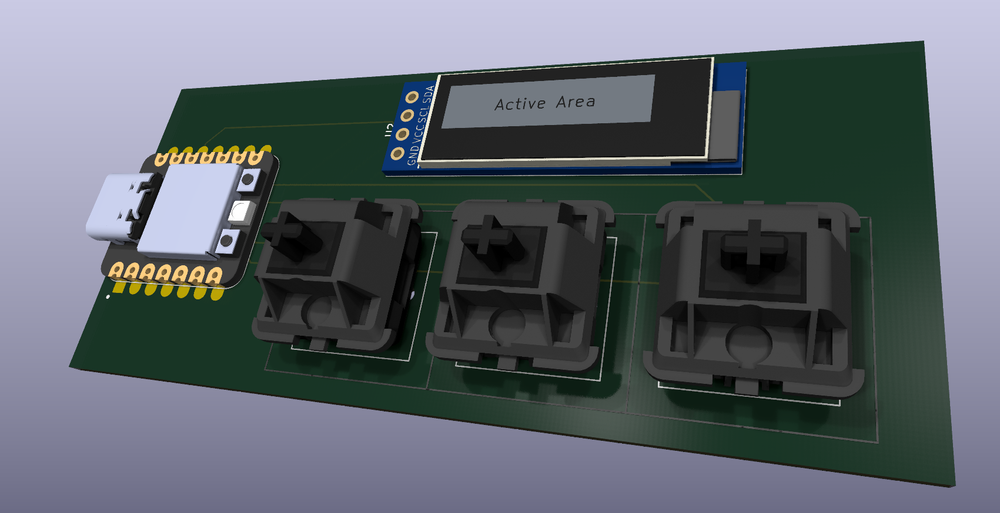
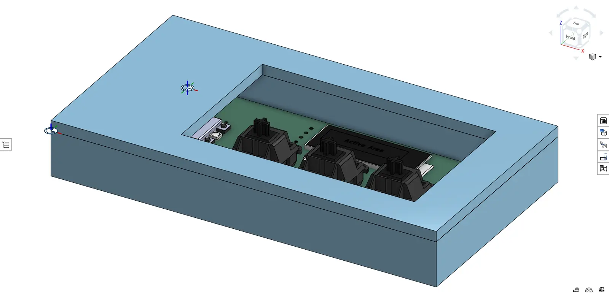
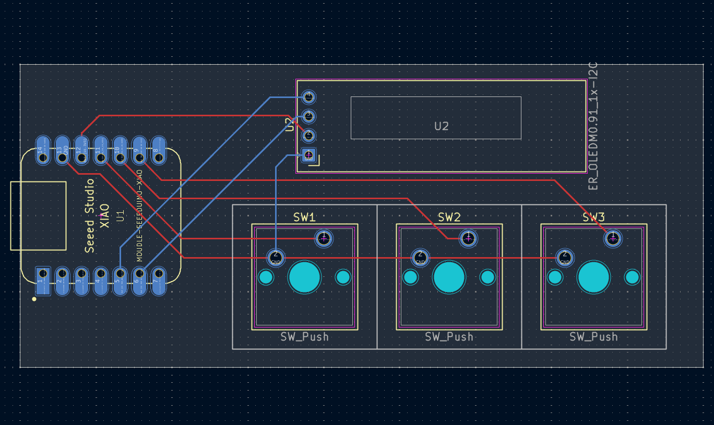
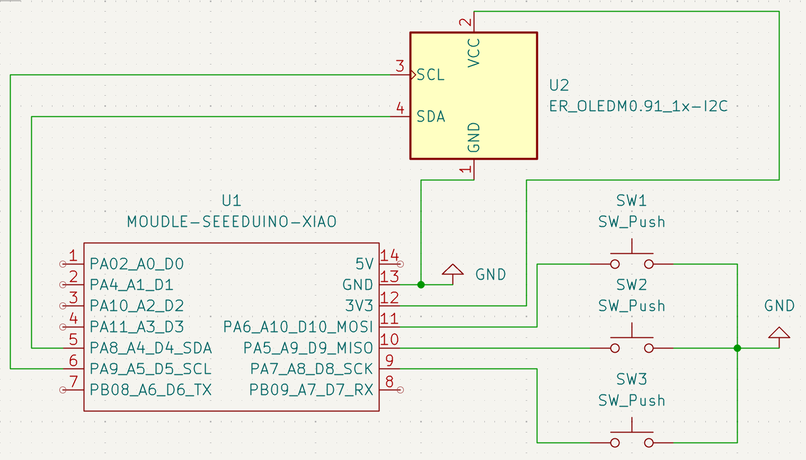

# ⌨️ First-Hackpad: A 3-Key Mechanical Macro Pad

A compact, custom-designed three-key mechanical macro pad built using the Seeed Studio XIAO RP2040 microcontroller. This project helps learn the basics of PCB design, schematic layout, and planning while turning the idea into a simple hackpad.

## CAD

The STEP files for the case are in the [CAD](CAD) folder.

## PCB

## Usage
**Codebud** is a hackpad designed to help programmers in VS Code. Instead of navigating menus or remembering keyboard shortcuts, users can press dedicated keys to launch frequently used actions.

Key 1: Ctrl+Shift+P - Command Palette
Key 2: Ctrl+Alt+I - Copilot Chat
Key 3: Ctrl+Shift+` - Terminal

Please follow the readme in 'firmware' folder for installation instructions

## BOM

| Item | Quantity |
| --- | --- |
| Unsoldered Seeed XIAO RP2040 | 1 |
| MX-Style switches | 3 |
| 0.91 inch OLED display | 1 |
| White blank DSA keycaps | 3 |
| $15 PCB Grant | 1 |
| 3D Print | 1 |
