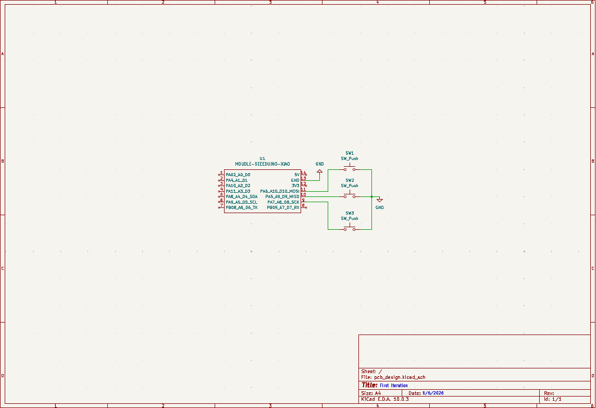
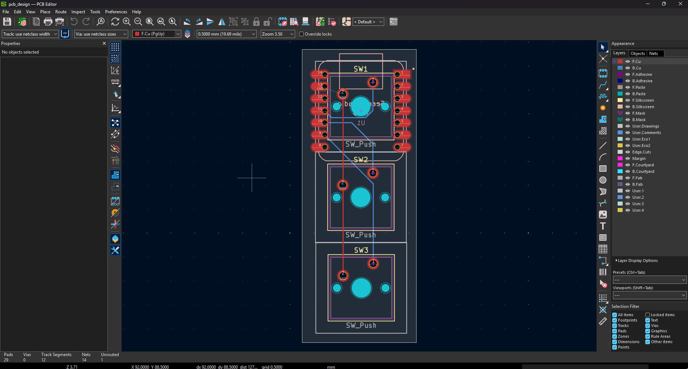
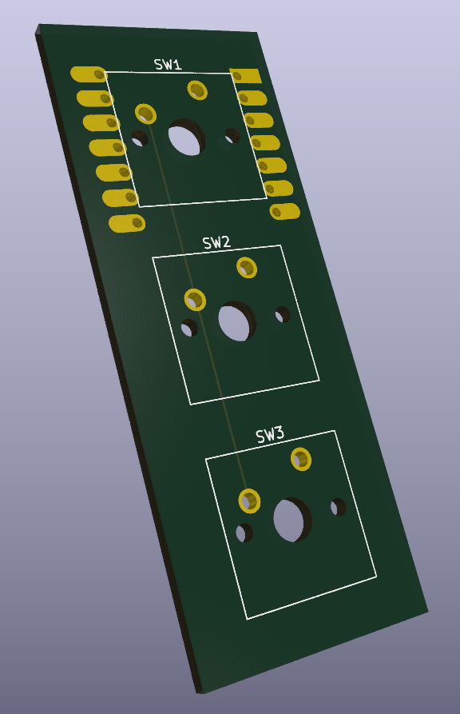

# ⌨️ First-Hackpad: A 3-Key Mechanical Macro Pad

Welcome to **First-Hackpad**, a compact, custom-designed three-key mechanical macro pad built around the **Seeed Studio XIAO RP2040** microcontroller. This project serves as an introductory hardware design, bridging the gap between PCB schematics, physical layouts, and routing.

---

## 🌟 Key Features

*   **Microcontroller:** Powered by the Seeed Studio XIAO RP2040.
*   **Mechanical Switches:** Features 3 MX-compatible mechanical key switches.
*   **Production-Ready PCB:** Complete KiCad 6+ schematic and layout files ready for fabrication.

---

## 🗺️ Pin Connection & Layout Mapping

The switches are wired directly to the following pins on the XIAO RP2040:

| Switch Reference | XIAO RP2040 Pin | Net / Function |
| :---: | :---: | :---: |
| **SW1** | `D10` (GP4) | Key 1 |
| **SW2** | `D9` (GP3) | Key 2 |
| **SW3** | `D8` (GP2) | Key 3 |

---

## 🛠️ Hardware Design

All design files are located in the `pcb_design-1/` directory. Created using KiCad, the project includes custom footprints for Cherry MX key switches and the XIAO form factor.

### 📐 Schematic Diagram
The switches connect on one side to their respective digital pins and on the other side to a common ground (`GND`).



### 🗺️ PCB Layout Routing
A clean 2-layer board layout routing digital signals on the top layer and utilizing a bottom solid ground plane.



### 📦 3D Render
A preview of the finished hardware showing the key switch positioning and the XIAO RP2040 mounting area.



---

## 📂 Project Structure

```
├── pcb_design-1/     # KiCad schematic, PCB layout, and project configuration
├── progress-pics/    # Schematics and PCB render images
├── source-code/      # CircuitPython macro pad source code
└── README.md         # Project documentation (this file)
```
